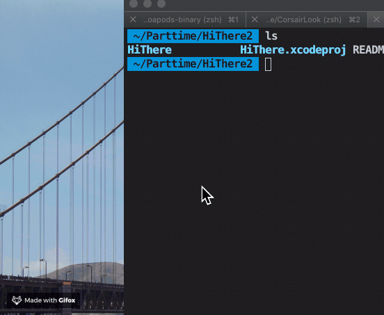

# HiThere

popup a image beside the cursor.

#

Feeling annoying and shake your mouse crazily? Place something or someone that make you smile.

## How to use

- download and run the app
- shake your mouse rapidly ( more then 5 times )
- no step 3

## How did you do that?

Actually it’s pretty easier than you may think. The key concept is that the view besides cursor is an application window.
- Make a floating window, so it can show above other windows even it's not active.
- Observe the position of cursor. Analyze the trace to detect a mouse shake. And move the window if triggered.

## License

MIT
